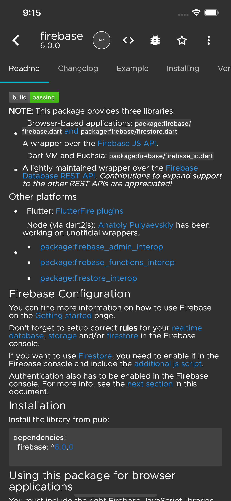
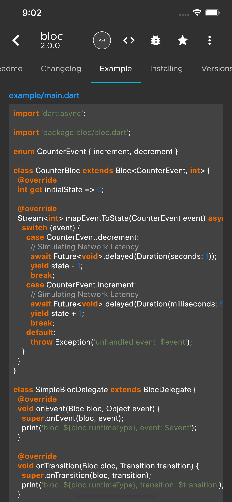
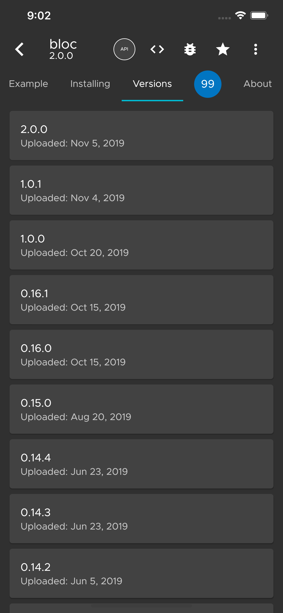
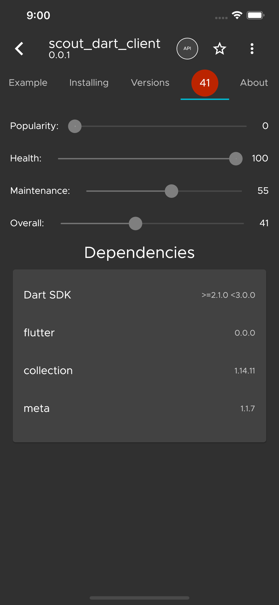
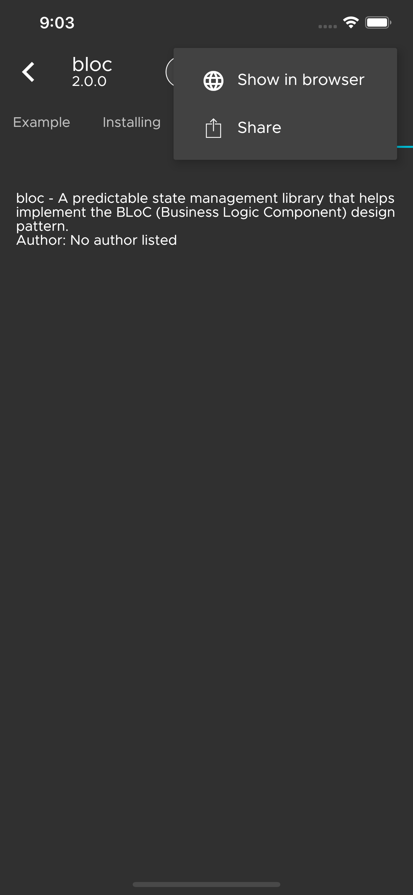

# Tavern

An open-source pub.dev client for searching and subscribing to packages. 

## Roadmap

- [X] Search pub.dev
- [ ] Subscribe to updates for a given package.
- [ ] Subscribe to the new packages feed
- [ ] Organize subscriptions into projects 
- [X] Add the ability to share a package 

## Screenshots
### iOS Screenshots
<!---->

 
<!---->

 
<!---->

<!---->

 
<!---->

 
<!---->

 
<!---->

 
<!---->

